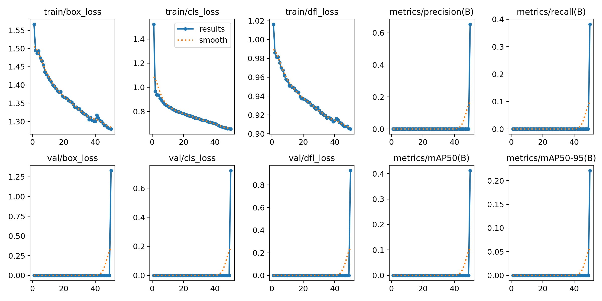
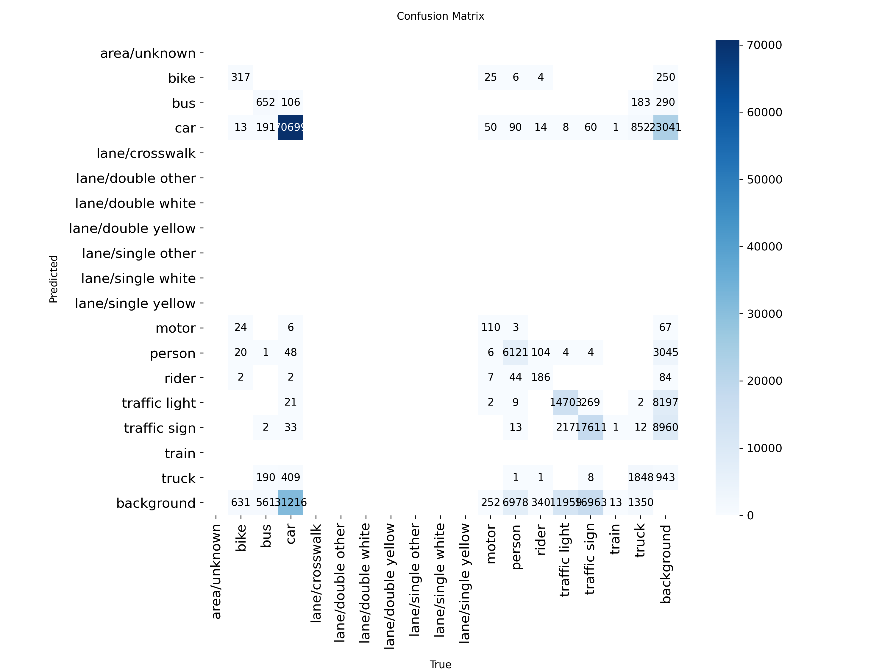
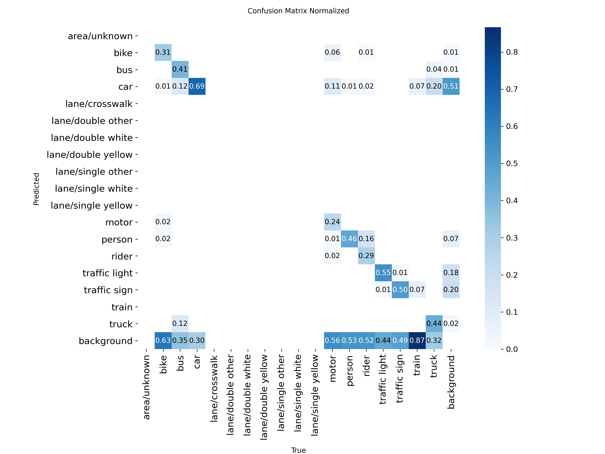
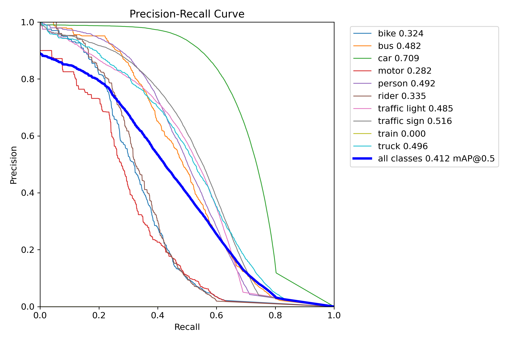
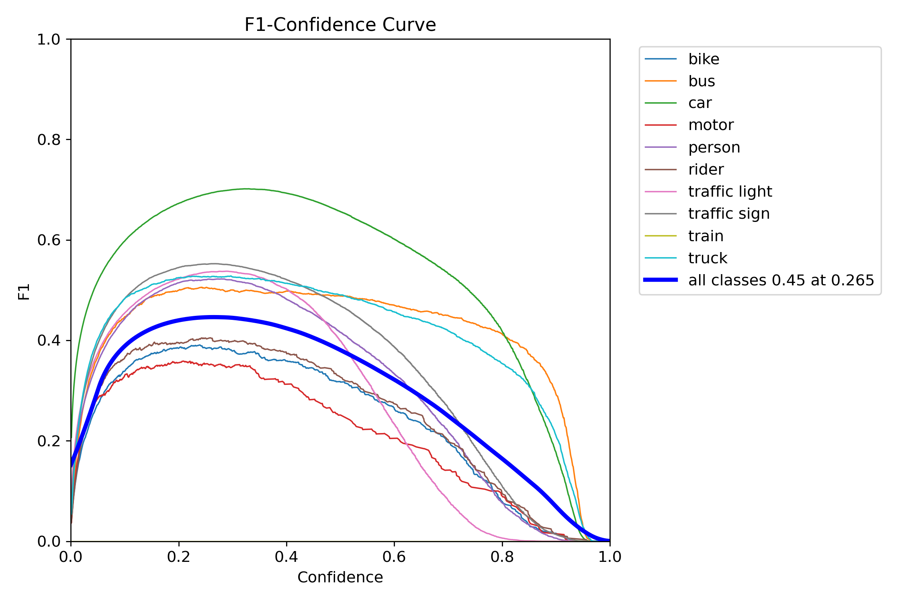
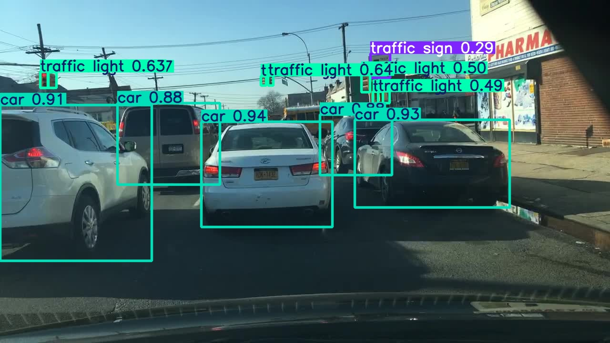
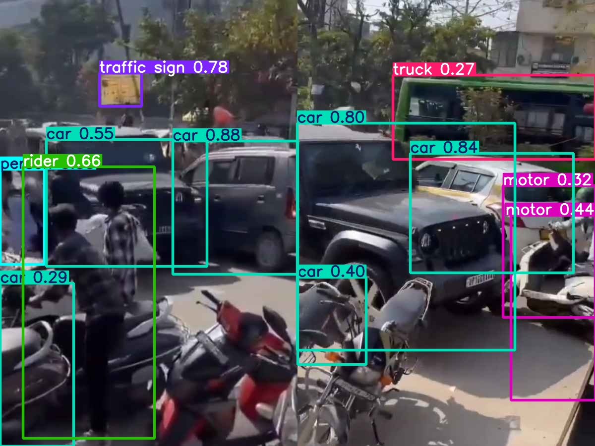

# Intelligent Transportation System Using Deep Neural Networks

## Overview
This project presents an end-to-end deep learning pipeline for intelligent transportation systems using the YOLOv8s model.

The system detects and classifies traffic objects such as:
- Cars
- Buses
- Trucks
- Pedestrians
- Traffic Lights
- Traffic Signs

The model is trained on the BDD100K dataset and is designed for real-time traffic monitoring and smart city applications.

## Objective
The objective of this project is to develop a real-time traffic object detection system using deep learning techniques to support intelligent transportation systems, traffic monitoring, and smart city applications.

## Dataset
This project utilizes the BDD100K (Berkeley DeepDrive 100K) dataset, which contains diverse road scenes captured under varying weather, lighting, and traffic conditions. The dataset includes annotations for multiple traffic-related object classes used for training and evaluation.

## Technology Stack
- Python
- Google Colab
- YOLOv8s
- OpenCV
- Ultralytics
- NumPy
- Matplotlib
  
## Model Details
- Model: YOLOv8s (Small Variant)
- Classes: 6
- mAP@0.5 = 0.41
- mAP@0.5:0.95 = 0.28
- Inference Speed: 28–32 FPS
  
## Applications
- Intelligent Transportation Systems
- Traffic Monitoring
- Smart Cities
- Autonomous Driving
- Road Safety Analysis

## Conference Publication
Accepted (Provisional) at the International Conference on AI-Powered Technology Integration for Sustainability (AI-PTIS 2026).

## Future Work
- Improve small-object detection accuracy.
- Enhance performance under adverse weather conditions.
- Integrate object tracking for continuous vehicle monitoring.
- Compare performance with additional state-of-the-art detection models.
  
## Project Results
The following figures illustrate the training performance, evaluation metrics, and sample detection outputs generated by the proposed YOLOv8s-based traffic object detection system.

### Training Results

### Confusion Matrix

### Normalized Confusion Matrix

### Precision-Recall Curve

### F1 Score Curve

### Traffic Detection Output

### Dense Traffic Detection Output

